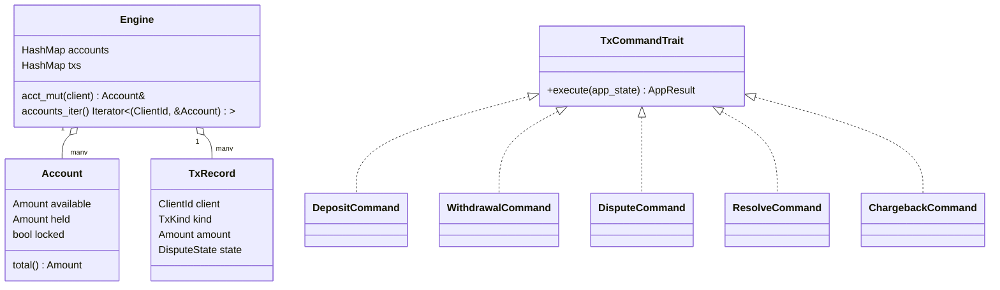

# payments-engine

A fast, deterministic, single-process **payments / transactions engine** written in Rust.  
It reads a CSV of transactions, applies them in **file order**, and prints the final per-client account balances to **stdout** (so you can redirect to a CSV).

```bash
cargo run -- transactions.csv > accounts.csv
```

> Designed for correctness (no precision loss), clarity, and easy extensibility.


## Table of Contents

- [Features](#features)
- [Quick Start](#quick-start)
- [CSV Formats](#csv-formats)
- [Precision Model](#precision-model)
- [Project Structure](#project-structure)
- [Core Models](#core-models)
- [Services & Main Logic](#services--main-logic)
- [Error Handling](#error-handling)
- [Architecture](#architecture)
- [Design Decisions](#design-decisions)
- [Testing](#testing)
- [Future Work](#future-work)
- [License](#license)


## Features

- Streaming CSV **input**; **no full-file load**.
- Exact **4-decimal** precision using fixed-point integer arithmetic.
- Implements **deposit**, **withdrawal**, **dispute**, **resolve**, **chargeback**.
- **Chargeback** locks the account; further transactions are ignored.
- Robust to malformed rows and unexpected operations (ignored safely).
- Clean separation of **models**, **services**, and **CLI**.


## Quick Start

1. **Build & run**:
   ```bash
   cargo build
   cargo run -- transactions.csv > accounts.csv
   ```

2. **Help**:
   ```bash
   cargo run -- --help
   ```

3. **Example**:
    - `test_files/transactions.csv` → input transactions
    - Write results to stdout and redirect:
      ```bash
      cargo run -- test_files/transactions.csv > accounts.csv
      ```


## CSV Formats

### Input (`transactions.csv`)

Header:
```
type,client,tx,amount
```

Rows:
- `deposit, <client:u16>, <tx:u32>, <amount:decimal up to 4dp>`
- `withdrawal, <client>, <tx>, <amount>`
- `dispute, <client>, <tx>,`
- `resolve, <client>, <tx>,`
- `chargeback, <client>, <tx>,`

### Output (stdout → `accounts.csv`)

Header:
```
client,available,held,total,locked
```

- `available`, `held`, `total` printed with **exactly 4 decimal places**.
- `total = available + held`.
- `locked` is `true` after a chargeback.


## Precision Model

**Why not `f64`?** The spec requires exact 4-decimal precision. Floating-point math introduces rounding error.  
We represent money as a fixed-point `Amount(i64)` scaled by **10,000** (1 unit = 0.0001).

- Parse: `"12.3456"` → `Amount(123456)`
- Print: `Amount(123456)` → `"12.3456"`
- All arithmetic is done on `i64` with checked add/sub to avoid overflow.


## Project Structure

```
src/
├─ models/
│  ├─ csv_models/
│  │  ├─ mod.rs
│  │  └─ transaction.rs        # CSV DTOs (input/output) & normalization
│  ├─ amount.rs                # Amount (fixed-point 4dp), parse/format
│  ├─ domain_state.rs          # Account, TxRecord, TxKind, DisputeState
│  ├─ identifiers.rs           # ClientId, TxId, etc.
│  └─ tx_command.rs            # Command types + trait (execute)
├─ services/
│  ├─ commands/
│  │  └─ mod.rs                # process_*_command implementations
│  ├─ csv_service.rs           # CSV streaming read/emit functions
│  ├─ mod.rs
│  ├─ cli.rs                   # clap CLI (positional input path)
│  ├─ consts.rs                # (optional) constants & toggles
│  ├─ errors.rs                # AppErrors / AppResult
│  └─ state.rs                 # AppState / Engine (accounts + txs)
├─ main.rs                     # wires CLI → CSV service → engine
test_files/                    # example CSVs
```

> The exact file names in your tree match the above; this README describes the intent of each.


## Core Models

### `Amount` (in `models/amount.rs`)
- `pub struct Amount(pub i64);` // scaled by 10,000
- `parse_4dp(&str) -> Result<Amount, AmountParseError>`: robust string → fixed-point
- `Display` impl prints with **exactly 4dp**.
- `checked_add/checked_sub` for safe arithmetic.

### Domain state (in `models/domain_state.rs`)
- `Account { available: Amount, held: Amount, locked: bool }`
    - `total()` returns `available + held`.
- `TxRecord { client, kind: TxKind, amount, state: DisputeState }`
- `enum TxKind { Deposit, Withdrawal }`
- `enum DisputeState { Normal, Disputed, ChargedBack }`

### Identifiers (in `models/identifiers.rs`)
- `type ClientId = u16;`
- `type TxId = u32;`

### Commands (in `models/tx_command.rs`)
- Per-command structs (e.g., `DepositCommand`, `WithdrawalCommand`, etc.)
- Common trait:
  ```rust
  pub trait TxCommandTrait {
      fn execute(&self, app_state: &mut AppState) -> AppResult<()>;
  }
  ```
- Normalization from CSV happens in the CSV layer; commands only contain validated fields.


## Services & Main Logic

### Engine / AppState (in `services/state.rs`)
- `Engine` holds:
    - `accounts: HashMap<ClientId, Account>`
    - `txs: HashMap<TxId, TxRecord>`
- Helpers:
    - `acct_mut(client)` creates-or-returns the account.
    - `accounts_iter()` yields all `(ClientId, &Account)` for emitting output.
- `AppState` owns an `Engine` and any future config/metrics.

### Command processors (in `services/commands/mod.rs`)
Each command’s `execute` method calls a small function (`process_*_command`) that mutates the engine in a **single-threaded** and **deterministic** way:

- **Deposit**
    - Guard: ignore if account locked or duplicate `tx`.
    - `available += amount`
    - Insert `TxRecord { kind=Deposit, state=Normal }`

- **Withdrawal**
    - Guard: ignore if locked, duplicate `tx`, or `available < amount`.
    - `available -= amount`
    - Insert `TxRecord { kind=Withdrawal, state=Normal }`

- **Dispute**
    - Lookup `tx`; must belong to client; must be `Deposit` and `state=Normal`.
    - Move funds `available → held` by the tx `amount`.
    - Mark tx `state=Disputed`.

- **Resolve**
    - Lookup `tx`; must belong to client; `state=Disputed`.
    - Move funds `held → available` by the tx `amount`.
    - Mark tx `state=Normal`.

- **Chargeback**
    - Lookup `tx`; must belong to client; `state=Disputed`.
    - Decrease `held` by the tx `amount` (total is reduced implicitly).
    - Mark tx `state=ChargedBack` and set account `locked=true`.

These transformations uphold the invariants:
- `available ≥ 0`, `held ≥ 0`
- `total = available + held`
- once `locked`, ignore further commands for that client.

### CSV service (in `services/csv_service.rs`)
- **Reading**:
    - Stream `Reader::deserialize::<CsvInputRow>()`.
    - Normalize each row into a concrete command struct.
    - Call `cmd.execute(&mut app_state)`.
    - Policy: malformed/invalid rows are **logged & skipped** (robust runner).

- **Writing**:
    - Iterate `engine.accounts_iter()`.
    - Serialize `OutputRow` with `available`, `held`, `total` as **4dp strings**.
    - Print to **stdout** (use shell redirection to save to file).

### CLI (in `cli.rs` and `main.rs`)
- Single positional arg: input CSV path.
- Usage:
  ```bash
  cargo run -- <INPUT.csv> > accounts.csv
  ```


## Error Handling

`services/errors.rs` defines an `AppErrors` enum and `AppResult<T>` type alias.
- Arithmetic overflow → `AppErrors::Overflow`
- CSV & IO errors are wrapped → `AppErrors::Io(String)`
- Invalid rows (e.g., missing amounts) → `AppErrors::InvalidInput(&'static str)`  
  Engine prefers **ignore + log** for invalid operations to remain robust.


## Architecture

### Flow (high level)


### Domain & Command interactions



### Dispute lifecycle


## Design Decisions

- **Single-threaded** apply loop for determinism and simplicity.
- **Fixed-point `Amount(i64)`** to satisfy the “no precision loss” requirement.
- **Ignore invalid or out-of-order ops** (e.g., resolve for unknown tx) rather than failing the whole run.
- **Chargeback locks the account**, ignoring any future txs for that client.


## Testing

- Place inputs in `test_files/`. Example provided in the repository.
- Run:
  ```bash
  cargo test
  ```
- Suggested tests:
    - Golden test for a known input → expected output.
    - Edge cases: insufficient withdrawals, disputes on withdrawals, duplicate tx ids, post-lock transactions, rounding to 4dp.

A larger sample dataset (good for integration) is in this README’s discussion; feel free to copy it into `test_files/transactions_large.csv` and assert the expected output.


## Future Work

- Configurable policies (e.g., disputing withdrawals, duplicate tx behavior).
- Actor-based shard model for parallelism per client.
- Persistent storage backends (e.g., sled, sqlite) behind repository traits.
- Structured logging / metrics (e.g., `tracing`).


## License

